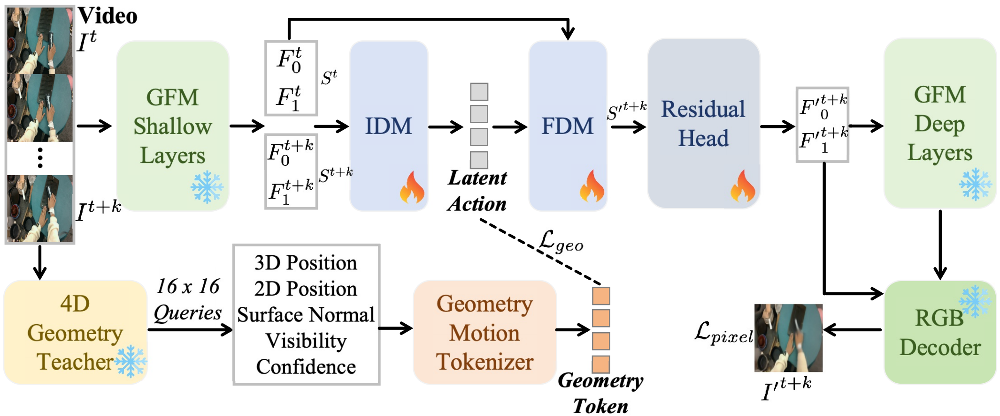

# GeoLAM: Learning Geometry-Grounded Latent Actions from Unlabeled Human Videos



## Requirements

- Linux, Python 3.10, NVIDIA GPUs, and CUDA-compatible PyTorch
- GLD and Open-D4RT weights in this repository (see `configs/lam_3d_pixel.yaml`)
- A frame-folder dataset or a directory containing videos (`.mp4`, `.avi`, `.mov`)

Create the tested environment, or install the project into an existing one:

```bash
conda activate geolam
python -m pip install -e .
```

The repository expects these paths unless overridden in the config:

```text
third_party/GLD/pretrained_models/da3/
third_party/GLD/pretrained_models/mae_decoder.pt
checkpoints/d4rt/OpenD4RT_32CLIP_9Dataset_NoAUG/{model.yaml,opend4rt.ckpt}
```

## Data

Frame folders use one folder per sequence:

```text
DATA_ROOT/sequence_000/00000.png
DATA_ROOT/sequence_000/00001.png
```

For a flat video directory, the loader samples frames from each video and
creates adjacent training pairs:

```text
DATA_ROOT/video_000.mp4
DATA_ROOT/video_001.mp4
```

## Multi-node training

The supplied command launches `torch.distributed.run`. From the repository
root, run the following on every node:

```bash
conda activate geolam
export DATA_ROOT=data/train
echo "HOSTNAME=$HOSTNAME PET_NNODES=$PET_NNODES PET_NODE_RANK=$PET_NODE_RANK WORLD_SIZE=$WORLD_SIZE"
bash scripts/train_lam_multi_node_da3_pixel.sh
```

Set `PET_NNODES` and `PET_NODE_RANK` (or `NNODES` and `NODE_RANK`) for the
cluster. The first node is rank 0. Set `PET_MASTER_ADDR` to the rank-0 host and
use the same `PET_MASTER_PORT` on all nodes. By default the script uses GPUs
`0,1,2,3,4,5,6,7`; override with `CUDA_VISIBLE_DEVICES`.

Set `DATA_ROOT` to one mounted dataset directory, or use the
colon-separated `DATA_ROOTS_OVERRIDE` variable for multiple directories.
Useful overrides include:

```bash
DATA_ROOT=data/train \
CUDA_VISIBLE_DEVICES=0,1,2,3,4,5,6,7 \
BATCH_SIZE=64 STEPS=200000 SAVE_STEPS=10000 \
bash scripts/train_lam_multi_node_da3_pixel.sh
```

Outputs are written to `outputs/d4rt_pixel/` (`lam_last.pt`, periodic
checkpoints, and `train.log`). Use `CONFIG`, `OUTPUT_DIR`, `LAM_PYTHON`, and
the variables in the script to adapt paths or resource settings.

## RGB prediction

Transfer the action inferred from `--action-src` to `--condition`. The
`--action-tgt` image is the target paired with `--action-src` and is used only
to infer the latent action:

```bash
bash scripts/predict_rgb.sh \
  --checkpoint outputs/d4rt_pixel/lam_last.pt \
  --action-src examples/action_src.png \
  --action-tgt examples/action_tgt.png \
  --condition examples/condition.png \
  --output-dir outputs/predict_rgb \
  --config configs/lam_3d_pixel.yaml \
  --device cuda
```

The output directory contains `pred_rgb.png`, `prediction_comparison.png`,
`latent_action.pt`, and `metadata.json`. The checkpoint and decoder must use
the same config/model variant as training.
